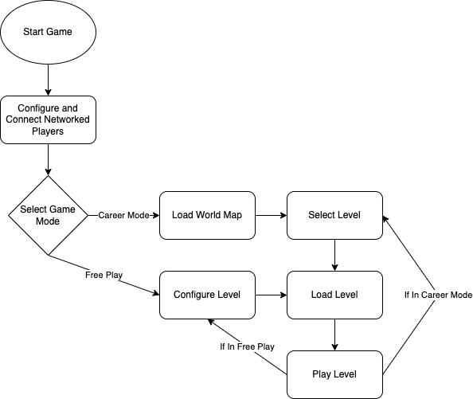
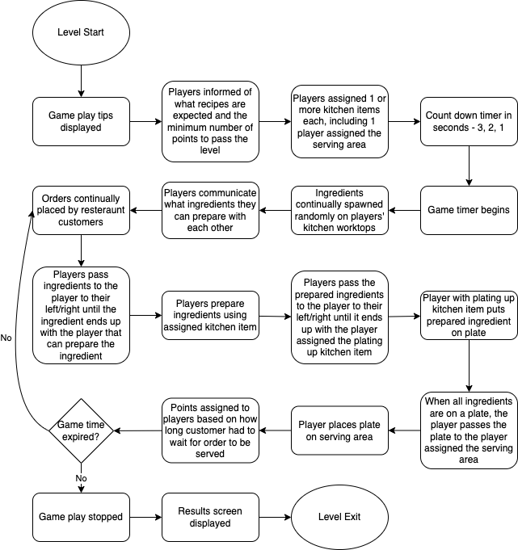

# Game Play

Having fun is the main game play objective. Game rules and logic should be simple and easy to learn and remember. Cooperative play is encouraged over competitive play.

- [Game Play](#game-play)
  - [Goals](#goals)
  - [Style](#style)
  - [Target Audience](#target-audience)
  - [Flow](#flow)
  - [Game Modes](#game-modes)
  - [Cooking Levels](#cooking-levels)

## Goals

Working as a group; gather ingredients and process and plate them according to set recipes within a set time limit.

## Style

Game sessions are easy to setup and simple to play. Game sessions should not be overly long in length or require much cognitive load. Fun is based on cooperation and group play. Challenge is based on inter-group communication, specific recipes to create and time limits.

## Target Audience

* A group with a minimum of 2 players and a maximum of 16 players
* Groups of people between 5 and 40 years of age
* Low technical skill required
* No real life cooking experience required
* Basic computer game experience beneficial
* Willing to communicate and cooperate with others

## Flow

The basic game flow is as follows:

## Game Modes

There are two main game modes, [career mode](career_mode.md) and [free play](free_play.md).

## Cooking Levels

A typical game level has the following flow:

