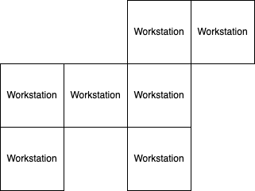

# Game Play

Having fun is the main game play objective. Game rules and logic should be simple and easy to learn and remember. Cooperative play is encouraged over competitive play.

- [Game Play](#game-play)
  - [Goals](#goals)
  - [Style](#style)
  - [Target Audience](#target-audience)
  - [Game Flow](#game-flow)
  - [Configuring Levels](#configuring-levels)
  - [Cooking Levels](#cooking-levels)
    - [Moving Between Workstations](#moving-between-workstations)
    - [Player Disconnections](#player-disconnections)
  - [Passing Ingredients](#passing-ingredients)
  - [Achievements](#achievements)
    - [Points](#points)
    - [Stars](#stars)

## Goals

Working as a group; gather ingredients and process and plate them according to set recipes within a set time limit.

## Style

Game sessions are easy to setup and simple to play. Game sessions should not be overly long in length or require much cognitive load. Fun is based on cooperation and group play. Challenge is based on inter-group communication, specific recipes to create and time limits.

## Target Audience

* A group with a minimum of 2 players and a maximum of 16 players
* Groups of people over 5 years of age
* Low technical skill required
* No real life cooking experience required
* Basic computer game experience beneficial
* Willing to communicate and cooperate with others

## Game Flow

The basic game flow is as follows:

## Configuring Levels

Each [kitchen](kitchens.md) has a set layout with a slots for workstations to be placed. Before a level can be played, the lead player (the server) must fill these slots with the workstations they have access to. Every kitchen has a set of required workstations.

After the kitchen has been layed out, each player must then select the workstation they will start at. This will be done using the workstation selection screen (also called the kitchen lobby screen).

## Cooking Levels

A typical game level has the following flow:

### Moving Between Workstations

Players can move between workstations during game play. They will do this by using the same workstation selection screen used when they chose their initial workstations.

### Player Disconnections

If a player gets disconnected from game play (or the app stops running, due to being minimized/put into the background on a mobile device etc...), that player automatically gets removed from active game play. When that player reconnects (or the app starts running again), they will start out at the workstation selection screen.

## Passing Ingredients

The player has to pass ingredients either up, down, left or right to a different workstations. As workstations are positioned in a grid, the player must keep in mind where a workstation is in relation to their current workstation. Workstations are positions directly next to each other, so there are no gaps between workstations.

Not all sides of a workstation will have an adjacent workstation. If there is no workstation on the side an ingredient is passed, that ingredient falls to the floor and is lost.

This is an example of how workstations may be positioned:

In the case that two workstations are found of equal distance to the current workstation, the workstation is randomly selected from those workstations.

## Achievements

For every level that is passed, the players involved are awarded points and stars. These can be used to purchase new workstations or upgrade existing [workstations](workstations.md).

### Points

Points are awarded based on the time it takes to complete an order. The quicker an order is served, the more points awarded.

### Stars

Each level has a minimum number of points required to count as a passed level. If the minimum number of points is not reached, the level is failed. Each level also has 3 stars that can be achieved. Each star also requires a set number of points. If the number of received points is greater than that required by a star, that star is awarded.
