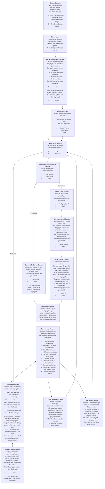

# Screens Map

This is a map of all screen in the game with their connections:

```mermaid
flowchart TD;
    splash_screens["<b>Splash Screens</b><br/>Fade in and out of the following logos.<br/>2 seconds each.<br/>Can tap to skip logo.<ol><li>Unity Logo (if we use the free engine)</li><li>Snow Melt Arcade Logo</li><li>The Chow Station Logo</li></ol>"]-->title_screen["<b>Title Screen</b><br/>Show game title and animated background.<br/>Player to tap/click to begin game.<br/>Menu background music starts."];
    title_screen-->player_information_screen["<b>Player Information Screen</b><br/>Displays a textbox where the player can enter their game handle.<br/>The game handle cannot be blank.<br/>If it is, an error message is displayed.<br/>Also displays an avatar selection control.<br/>The following options are displayed:<ol><li>OK</li></ol>If this screen was entered by the `Options Screen`,<br/>the following options are also displayed:<ol><li>Back</li></ol>"];
    player_information_screen-->main_menu_screen["<b>Main Menu Screen</b><br/>Shows game menu with the following options:<ol><li>Play</li><li>Options</li></ol>"];
    player_information_screen<-->options_screen["<b>Options Screen</b><br/>Shows the following game options:<ol><li>Music On/Off (Default on)</li><li>Sfx On/Off (Default on)</li><li>Update Player Information</li><li>Back</li></ol>"];
    options_screen<-->main_menu_screen;
    main_menu_screen<-->player_connect_options_screen["<b>Player Connect Options Screen</b><br/>Shows the following connect options:<ol><li>Start Game</li><li>Join Game</li><li>Back</li></ol>"];
    player_connect_options_screen<--Start Game-->select_level_screen["<b>Select Level Screen</b><br/>Presents the levels to select from.<br/>The following options are presented:<ol><li>Configure Level</li><li>Back</li></ol>"];
    select_level_screen<-->configure_level_screen["<b>Configure Level Screen</b><br/>Presents the level's kitchen layout and<br/>the available workstations.<br/>The player selects the workstations to use and<br/>places them in the workstation slots in the kitchen layout.<br/>The following options are presented:<ol><li>Setup Server</li><li>Back</li></ol>"];
    configure_level_screen<-->start_server_screen["<b>Start Server Screen</b><br/>Presents the server join code.<br/>The player should give this code to players who would like to join the server.<br/>A list of all players who have entered the code will be displayed.<br/>The player must explicitly allow players to join<br/>by clicking a button next to their name.<br/>The following options are presented:<ol><li>Let’s Go!</li><li>Back</li></ol>"];
    player_connect_options_screen<--Join Game-->connect_to_server_screen["<b>Connect To Server Screen</b><br/>Presents a textbox for the player to enter a server connect code.<br/>The following options are presented:<ol><li>Join Game</li><li>Back</li></ol>If the player cannot connect to the server<br/(either because the code is incorrect or a wifi/bluetooth issue etc...),<br/>an error message is displayed."];
    connect_to_server_screen-->load_level_screen["<b>Load Level Screen</b><br/>Displays a helpful tip for how to play the game whilst the level is loading.<br/>An animation indicating the game is loading (and has not crashed) is displayed."];
    start_server_screen-->load_level_screen;
    load_level_screen-->game_level_screen["<b>Game Level Screen</b><br/>Displays the game level.<br/>Plays game level music.<br/>The following elements are displayed:<ol><li>The assigned workstation</li><li>Previews of all other workstations</li><li>The ability to move to a different workstation</li><li>The time left until the level ends</li><li>A menu button</li><li>The ingredients on the workstation</li><li>The workstation item</li><li>The number of points the players have</li><li>All current menu orders</li></ol>"];
    game_level_screen<-->level_menu_screen["<b>Level Menu Screen</b><br/>Displays in the level menu with the following options:<ol><li>Exit Level (Returns to the ‘Main Menu Screen’)</li><li>Back</li></ol>If the player is the server, the following options are also displayed:<ol><li>Pause/Resume Game</li><li>Remove Player</li></ol>If the player is the server and there are no other connected players,<br/>the game will automatically pause whilst this menu is open.</li><li>If the player is the server and they exit the level,<br/>the level is stopped and all connected players are disconnected."];
    level_menu_screen<-->remove_player_screen["<b>Remove Player Screen</b><br/>Displays a list of all connected players.<br/>A button next to each player can be clicked/<br/>tapped to instantly disconnect that player from the game.<br/>The following options are also displayed:<ol><li>Back</li></ol>This screen is only displayable if the player is the server."];
    level_menu_screen--Exit Level-->main_menu_screen;
    game_level_screen-->level_success_screen["<b>Level Success Screen</b><br/>Displays a success message,<br/>a success animation and plays success music.<br/>The number of points is displayed as well as<br/>the number of stars the players earned.<br/>When the player taps the screen,<br/>they return to the ‘Main Menu Screen’."];
    game_level_screen-->level_failed_screen["<b>Level Failed Screen</b><br/>Displays a failure message,<br/>a failure animation and failure music.<br/>The number of points is displayed as well as<br/>the number of stars the players earned.<br/>When the player taps the screen,<br/>they return to the ‘Main Menu Screen’."];
    level_success_screen-->main_menu_screen;
    level_failed_screen-->main_menu_screen;
```
